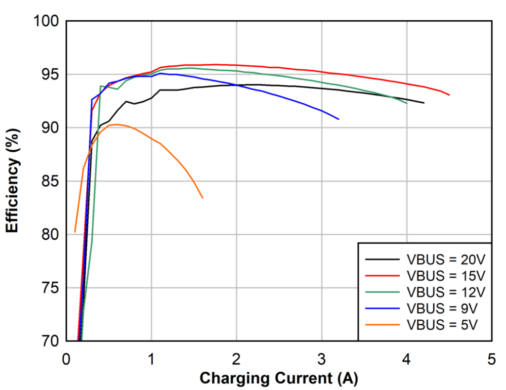

# Hardware notes

## PCB

### Specifications

* 4 layers
* FR-4
* 1 mm thickness
* all layers (including internal) 1 oz copper

The design around the bq25792 with its inductor and capacitors follows the guidelines given in the datasheet, and takes the EVM design as a basis. However, due to space constraints and the oblong shape, some compromises in the PCB layout had to be made: the bq25792 has been rotated 180° respective to the reference design, making the switching nodes slightly longer and closer to other traces. Care was taken to keep them isolated from other traces by intermediate ground plane layers.

The goal was to design the board such that it could be produced and assembled by low-cost services like JLCPCB (“Economic PCBA”). Only very few components are on the bottom side, and are big enough to be hand-soldered. Traces, via holes etc. are fairly large to avoid precision PCB costs.

## Side panel

### Specifications

* Aluminum 6061
* Bead blasted, hardcoat anodized and silkscreened

## Cost

Most of the parts are relatively low cost, and the board was designed so that it can be produced and assembled by low-cost services like JLCPCB, with almost all passive components from the “Basic” component selection that doesn't incur component loading fees.

The total BOM at qty. 10 is around $25/pc. (including PCB production and assembly), plus $12/pc. for the CNC milled, anodized and silkscreen printed side panel.

## Efficiency

The graph above is taken from the bq25792's datasheet. I've done some casual measurements, both using the bq25792's internal ADC and shunts, and with external power meters, and they agree with the data in the graph: around 95% when charging from 15 V, and between 85% and 90% from 5 V (depending on the current). There seems to be no problem dissipating the maximum possible loss of around 3 W through the side panel (thermal pad between the IC and the panel), and in any case, the charger IC has thermal regulation and shutdown.

## Power connection to the KX2

Like the KXIBC2, the KXUSBC2 is intended to be wired to the “E” and “B” pads on the KX2 RFC PCB (under the battery) for connection to the external DC jack and the internal battery jack, respectively. Refer to the [KXIBC2 manual](https://ftp.elecraft.com/KX2/Manuals%20Downloads/E740370-B5,%20KXIBC2%20manual.pdf) for details.

The PCB trace resistance between the “B” pad on the RF PCB and the central pin on the internal battery connector was measured to be around 5 mΩ (4T/Kelvin measurement). So although the pad/trace were probably not intended for this much current, they should have no problems handling 3 A.

## RTC
Some people like to use the clock provided by the KXIO2/KXIBC2 options for logging. The RTC chip that Elecraft uses (PCF2123) is obsolete, and the successors use a different register mapping that would require KX2 firmware modifications. As the MCU has spare capacity, I opted to use its internal RTC instead, emulating the few SPI commands that the KX2 uses to read/write the time in firmware. The RTC is clocked by a 32.768 kHz crystal, and the microcontroller consumes extremely little power for keeping the clock running.

The firmware automatically applies a temperature compensation, and one can also calibrate the clock using the KX2's "RTC ADJ" menu as usual.

Unlike the KXIO2/KXIBC2, the KXUSBC2 does not include a supercapacitor to keep the clock running during short power outages while swapping the battery. Having the KXUSBC2 installed means that most people probably won't need to swap out the battery anymore.

## Battery monitoring
The KXUSBC2 includes a similar circuit to the one on the KXIBC2 that allows the KX2 to display the actual battery voltage in the menu. It works by dividing down the battery voltage and buffering it with an op-amp before passing it to the microcontroller in the KX2.

Of course the KXUSBC2 itself knows all voltages and currents flowing through it precisely, but it has no way to display those values on the KX2's display, as we cannot modify the firmware.
